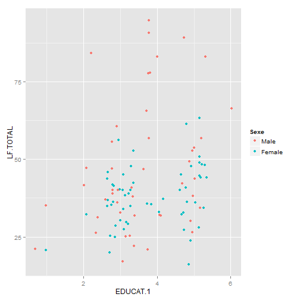
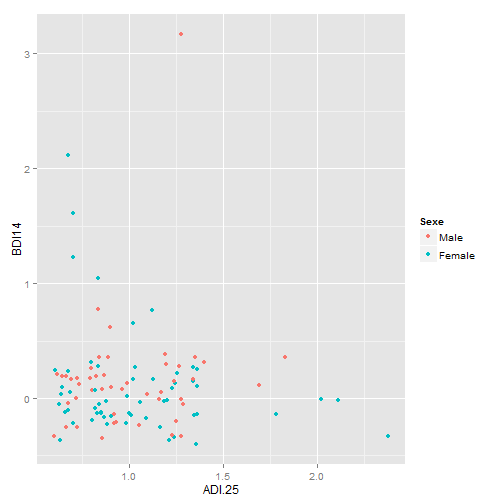

## Trash in, Trash out

The first goal of this app is to show it can be very important to preproces your data.If you use the PCA analyses and thereby reducing the redundant information, the algorithm can predict sexe.  

--- 

## How to interpret the prediction model?

-It is always hard to interpret a prediction model.  But you can try to interpret by looking and the variables that are most important. The top 5 important variables are given in the output to plot.

-It gets even more difficult to interpret if the variables are actually components of the principal component analysis. If the PCA is run, the output gives back the 5 most important variables of the 5 most important component.

---  

## The user can begin to explore these variables.

 

---

## But as you can see, it is hard to seperate males an females

 

---

## Some remarks.

-Very few data is used here. Therefore these predictions are very influenced by what sample it chosen for test and training set, this is seen by changing the random seeds.

-For a good prediction more samples are needed and cross validation is needed. But due to the lack of more data and the computational constrains of the app, this is not possible.

-Furthermore the main goal of the app is to show that pre-processing can make a difference and that interpretation is hard.

